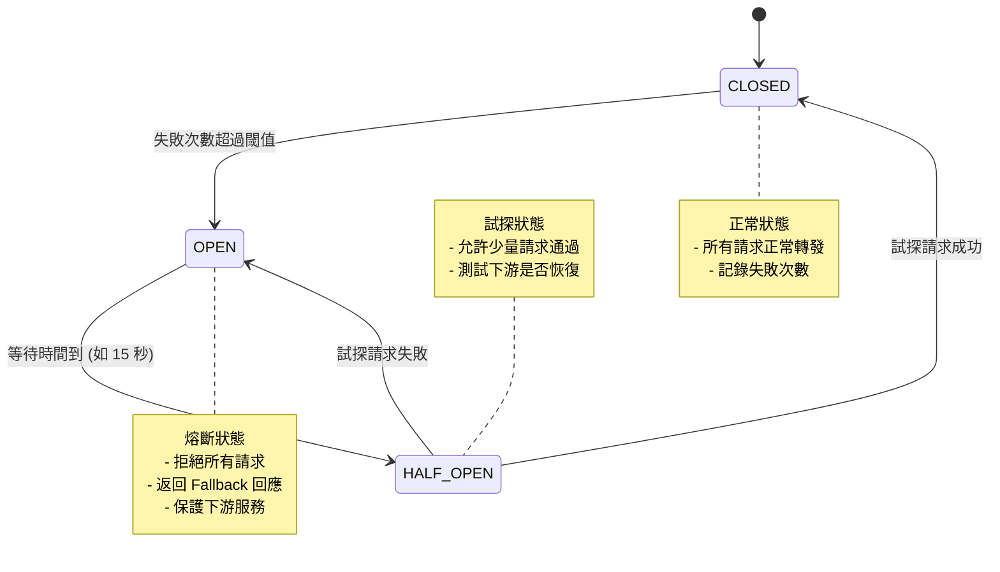
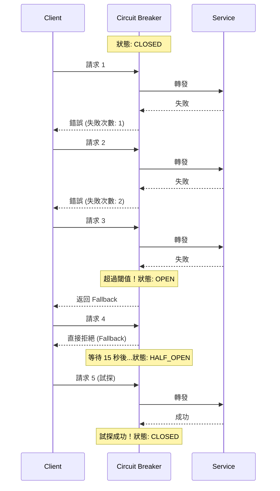
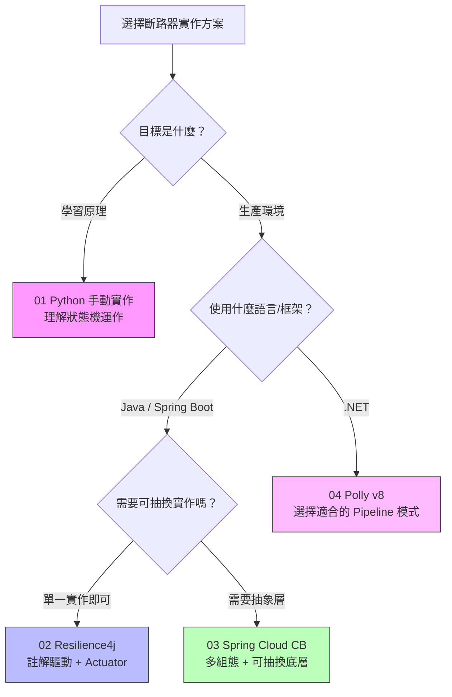
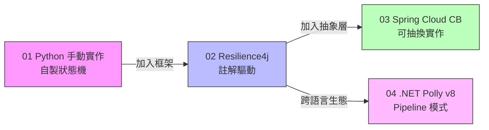

# 斷路器模式 (Circuit Breaker Pattern) — 四種語言實作比較

本專案提供斷路器模式的四種語言/框架實作，從手動狀態機到生產等級框架，循序漸進地展示斷路器的核心原理與最佳實踐。

> 本專案源自 [12-architecture-concepts](https://github.com/ChunPingWang/12-architecture-concepts) 的概念 7 (Circuit Breaker)，將原本嵌入在 Shell Script ConfigMap 中的程式碼提取為完整的獨立專案結構。

---

## 目錄

1. [斷路器原理](#斷路器原理)
2. [四種實作版本比較](#四種實作版本比較)
3. [專案結構](#專案結構)
4. [本地開發](#本地開發)
5. [測試](#測試)
6. [共用元件：Flaky Service](#共用元件flaky-service)
7. [01 - Python 手動實作](#01---python-手動實作)
8. [02 - Java Resilience4j](#02---java-resilience4j)
9. [03 - Spring Cloud Circuit Breaker](#03---spring-cloud-circuit-breaker)
10. [04 - .NET Polly v8](#04---net-polly-v8)
11. [選擇指南](#選擇指南)
12. [架構演進路線](#架構演進路線)

---

## 斷路器原理

斷路器模式靈感來自家用電路的保險絲：當電流過大時，保險絲會熔斷以保護整個電路。在分散式系統中，當下游服務故障時，斷路器會自動「熔斷」，避免連鎖失敗導致系統雪崩。

### 狀態轉換圖



### 運作時序



---

## 四種實作版本比較

| 特性 | 01 Python 手動實作 | 02 Java Resilience4j | 03 Spring Cloud CB | 04 .NET Polly v8 |
|------|-------------------|---------------------|-------------------|-----------------|
| **語言/框架** | Python 3.11 | Java 17 / Spring Boot 3 | Java 17 / Spring Boot 4 | .NET 8 / Minimal API |
| **函式庫** | 自製狀態機 | Resilience4j 2.2 | Spring Cloud CB + Resilience4j | Polly v8 + Microsoft.Extensions.Http.Resilience |
| **配置方式** | 程式碼參數 | YAML + 註解 | YAML + Factory | Fluent Builder + DI |
| **狀態管理** | 手動計數 | 滑動視窗 (COUNT/TIME_BASED) | 滑動視窗 (透過抽象層) | 取樣期間 (SamplingDuration) |
| **Fallback 策略** | if/else 判斷 | `@CircuitBreaker(fallbackMethod)` | Lambda `cb.run(() -> ..., fallback)` | try/catch 模式 |
| **監控/指標** | Console 日誌 | Actuator + 事件發布 | Actuator + 自訂 Dashboard | 自訂 Tracker + OpenTelemetry |
| **非 HTTP 支援** | 原生支援 | 需手動包裝 | 透過 Factory 支援 | 原生支援 (Generic Pipeline) |
| **重試整合** | 無 | 獨立 `@Retry` | YAML 配置 | Pipeline 內建 |
| **健康檢查** | 無 | Health Indicator | Health Indicator | HealthChecks |
| **生產就緒度** | 僅供學習 | 生產等級 | 生產等級 | 生產等級 |
| **適用場景** | 學習原理 | Spring Boot 生產環境 | 多雲/可抽換環境 | .NET 生產環境 |

---

## 專案結構

```
circuit-breaker-pattern/
├── README.md
├── .gitignore
├── docker-compose.yml           # 本地開發 stack（profile 機制）
├── Makefile                     # 快捷指令
├── shared/
│   └── flaky-service/           # 共用的不穩定下游服務
│       ├── app.py
│       ├── Dockerfile
│       └── k8s/
├── 01-python-manual/            # Python 手動實作
│   ├── app.py                   # HTTP 伺服器 + 呼叫下游
│   ├── circuit_breaker.py       # CircuitBreaker class（可獨立測試）
│   ├── tests/                   # pytest 單元測試
│   ├── requirements-test.txt
│   ├── Dockerfile
│   └── k8s/
├── 02-java-resilience4j/        # Spring Boot 3 + Resilience4j
│   ├── build.gradle
│   ├── gradlew / gradlew.bat    # Gradle Wrapper (8.10)
│   ├── src/main/
│   ├── src/test/                # WireMock 整合測試
│   ├── Dockerfile
│   └── k8s/
├── 03-spring-cloud-cb/          # Spring Boot 4 + Spring Cloud CB
│   ├── build.gradle
│   ├── gradlew / gradlew.bat    # Gradle Wrapper (8.12)
│   ├── src/main/
│   ├── src/test/                # Resilience4j + WireMock 單元測試
│   ├── Dockerfile
│   └── k8s/
└── 04-dotnet-polly/             # .NET 8 + Polly v8
    ├── CircuitBreakerDemo.csproj
    ├── Program.cs
    ├── appsettings.json
    ├── Services/
    ├── CircuitBreakerDemo.Tests/ # xUnit + WireMock.Net 測試
    ├── Dockerfile
    └── k8s/
```

---

## 本地開發

所有專案的下游 URL 均透過環境變數設定，預設指向 `http://localhost:8080`，無需 K8s 即可在本地開發與測試。

### 環境變數

| 專案 | 環境變數 | 預設值 |
|------|---------|--------|
| 01 Python | `DOWNSTREAM_URL` | `http://localhost:8080` |
| 02 Java | `DOWNSTREAM_URL` | `http://localhost:8080` |
| 03 Spring Cloud | `DOWNSTREAM_URL` | `http://localhost:8080` |
| 04 .NET | `DownstreamUrl` | `http://localhost:8080` |

### Docker Compose

使用 profile 機制選擇要啟動的服務：

```bash
# 啟動全部服務（flaky-service + 四種 CB 實作）
docker compose --profile all up --build

# 只跑 Python 版
docker compose --profile python up --build

# 只跑 Java 版（02 + 03）
docker compose --profile java up --build

# 只跑 .NET 版
docker compose --profile dotnet up --build

# 只跑下游服務（本地開發用）
docker compose up flaky-service --build
```

| 服務 | Port | Profile |
|------|------|---------|
| flaky-service | 8080 | (始終啟動) |
| python-cb | 8081 | `python`, `all` |
| java-resilience4j-cb | 8082 | `java`, `all` |
| spring-cloud-cb | 8083 | `java`, `all` |
| dotnet-polly-cb | 8084 | `dotnet`, `all` |

### Makefile 快捷指令

```bash
make up-all        # docker compose --profile all up --build
make up-python     # docker compose --profile python up --build
make up-java       # docker compose --profile java up --build
make up-dotnet     # docker compose --profile dotnet up --build
make down          # docker compose --profile all down
make test          # 執行所有測試
make test-python   # 只跑 Python 測試
make test-java-02  # 只跑 Java 02 測試
make test-java-03  # 只跑 Java 03 測試
make test-dotnet   # 只跑 .NET 測試
```

### 純本地開發（不用 Docker）

1. 先啟動下游服務：
   ```bash
   cd shared/flaky-service && python app.py
   ```

2. 在另一個終端啟動任一 CB 實作：
   ```bash
   # Python
   cd 01-python-manual && python app.py

   # Java 02
   cd 02-java-resilience4j && ./gradlew bootRun

   # Java 03
   cd 03-spring-cloud-cb && ./gradlew bootRun

   # .NET 04
   cd 04-dotnet-polly && dotnet run
   ```

---

## 測試

每個專案都包含獨立的測試，可在不啟動任何外部服務的情況下執行。

### 執行所有測試

```bash
make test
```

### 各專案測試

#### 01 - Python (pytest)

測試 `CircuitBreaker` class 的狀態轉換邏輯（CLOSED → OPEN → HALF_OPEN → CLOSED）。

```bash
cd 01-python-manual
python -m venv .venv && .venv/bin/pip install -r requirements-test.txt
.venv/bin/python -m pytest tests/ -v
```

#### 02 - Java Resilience4j (Spring Boot Test + WireMock)

使用 WireMock 模擬下游服務，測試斷路器在成功、失敗、OPEN、Reset 等場景的行為。

```bash
cd 02-java-resilience4j
./gradlew test
```

#### 03 - Spring Cloud CB (Resilience4j + WireMock)

直接測試 Resilience4j 斷路器邏輯搭配 WireMock，涵蓋狀態轉換與請求拒絕。

```bash
cd 03-spring-cloud-cb
./gradlew test
```

#### 04 - .NET Polly (xUnit + WireMock.Net)

使用 `WebApplicationFactory` 搭配 WireMock.Net 測試 Standard/Custom Pipeline 與 Dashboard。

```bash
cd 04-dotnet-polly
dotnet test
```

---

## 共用元件：Flaky Service

所有版本共用一個模擬不穩定行為的下游服務（60% 失敗率 + 3 秒延遲）。

**本地執行**

```bash
cd shared/flaky-service
docker build -t flaky-service .
docker run -p 8080:8080 flaky-service
```

**部署到 K8s**

```bash
kubectl apply -f shared/flaky-service/k8s/
```

---

## 01 - Python 手動實作

從零實作斷路器狀態機，透過 `threading.Lock` 保證執行緒安全，手動管理 CLOSED → OPEN → HALF_OPEN 三態轉換。

### 技術棧

- Python 3.11（純標準庫，零依賴）
- `http.server` 作為 HTTP 伺服器
- `threading.Lock` 保證執行緒安全

### 關鍵配置

```python
cb = CircuitBreaker(
    failure_threshold=3,      # 連續失敗 3 次觸發 OPEN
    recovery_timeout=15,      # 15 秒後嘗試 HALF_OPEN
    half_open_max=2           # 2 次成功恢復 CLOSED
)
```

### 本地執行

```bash
cd 01-python-manual
docker build -t cb-demo-python .
docker run -p 8083:8080 cb-demo-python
```

### 部署到 K8s

```bash
kubectl apply -f shared/flaky-service/k8s/
kubectl apply -f 01-python-manual/k8s/
```

### API 端點

| 方法 | 路徑 | 說明 |
|------|------|------|
| GET | `/` | 透過斷路器呼叫下游服務 |

---

## 02 - Java Resilience4j

使用 Resilience4j 的 `@CircuitBreaker` 註解，以宣告式方式在 Spring Boot 中啟用斷路器。

### 技術棧

- Java 17 / Spring Boot 3.2.5
- Resilience4j 2.2.0
- Spring Boot Actuator

### 專案結構

```
02-java-resilience4j/
├── build.gradle
├── settings.gradle
├── Dockerfile
├── k8s/
└── src/main/
    ├── java/com/poc/circuitbreaker/
    │   ├── CircuitBreakerDemoApplication.java
    │   ├── DownstreamService.java          # @CircuitBreaker 註解
    │   └── ApiController.java              # REST API + 狀態查詢
    └── resources/
        └── application.yml                 # Resilience4j YAML 配置
```

### 關鍵配置

```yaml
resilience4j:
  circuitbreaker:
    configs:
      default:
        slidingWindowType: COUNT_BASED
        slidingWindowSize: 5
        failureRateThreshold: 50
        waitDurationInOpenState: 15s
        permittedNumberOfCallsInHalfOpenState: 2
```

### 本地執行

```bash
cd 02-java-resilience4j
docker build -t r4j-circuit-breaker .
docker run -p 8086:8080 r4j-circuit-breaker
```

### 部署到 K8s

```bash
kubectl apply -f shared/flaky-service/k8s/
kubectl apply -f 02-java-resilience4j/k8s/
```

### API 端點

| 方法 | 路徑 | 說明 |
|------|------|------|
| GET | `/api/call` | 透過斷路器呼叫下游服務 |
| GET | `/api/status` | 查看 Circuit Breaker 即時狀態與設定 |
| GET | `/api/reset` | 手動重置 Circuit Breaker |
| GET | `/actuator/circuitbreakers` | Resilience4j 內建監控 |
| GET | `/actuator/circuitbreakerevents` | 斷路器事件紀錄 |

---

## 03 - Spring Cloud Circuit Breaker

使用 Spring Cloud 提供的 `CircuitBreakerFactory` 抽象層，將斷路器實作與業務程式碼解耦，支援多組態 profile（shared/strict）。

### 技術棧

- Java 17 / Spring Boot 4.0.0-M1
- Spring Cloud 2025.0.0-M1
- Spring Cloud Circuit Breaker + Resilience4j
- RestClient (Spring Boot 4 推薦)

### 專案結構

```
03-spring-cloud-cb/
├── build.gradle
├── settings.gradle
├── Dockerfile
├── k8s/
└── src/main/
    ├── java/com/poc/circuitbreaker/
    │   ├── CircuitBreakerDemoApplication.java
    │   ├── Resilience4jCustomizer.java     # 事件監聽 + RestClient Bean
    │   ├── DownstreamService.java          # CircuitBreakerFactory 抽象
    │   └── ApiController.java              # REST API + Dashboard
    └── resources/
        └── application.yml                 # 多組態 profile (shared/strict)
```

### 關鍵配置

```yaml
resilience4j:
  circuitbreaker:
    configs:
      shared:           # 一般服務
        failureRateThreshold: 50
        waitDurationInOpenState: 15s
      strict:           # 關鍵服務（更嚴格）
        failureRateThreshold: 40
        waitDurationInOpenState: 30s
    instances:
      downstreamService:
        baseConfig: shared
      criticalService:
        baseConfig: strict
```

### 本地執行

```bash
cd 03-spring-cloud-cb
docker build -t sccb-circuit-breaker .
docker run -p 8087:8080 sccb-circuit-breaker
```

### 部署到 K8s

```bash
kubectl apply -f shared/flaky-service/k8s/
kubectl apply -f 03-spring-cloud-cb/k8s/
```

### API 端點

| 方法 | 路徑 | 說明 |
|------|------|------|
| GET | `/api/call` | 一般服務呼叫 (downstreamService CB) |
| GET | `/api/call-critical` | 關鍵服務呼叫 (criticalService CB, 更嚴格) |
| GET | `/api/dashboard` | 所有 Circuit Breaker 狀態總覽 |
| GET | `/api/status/{name}` | 查看特定 CB 狀態 |
| GET | `/api/reset/{name}` | 重置特定 CB |
| GET | `/api/reset-all` | 重置所有 CB |
| GET | `/actuator/circuitbreakers` | Actuator 監控端點 |
| GET | `/actuator/health` | 健康檢查 (含 CB 狀態) |

---

## 04 - .NET Polly v8

使用 Polly v8 搭配 `Microsoft.Extensions.Http.Resilience`，提供三種 Pipeline 模式。

### 技術棧

- .NET 8 / Minimal API
- Polly v8 + Microsoft.Extensions.Http.Resilience
- OpenTelemetry Metering

### 三種 Pipeline 模式

| 模式 | 方法 | 說明 |
|------|------|------|
| Standard | `AddStandardResilienceHandler` | 一行搞定 CB + Retry + Timeout（推薦） |
| Custom | `AddResilienceHandler` | 自訂 Pipeline，精細事件回呼 |
| Generic | `AddResiliencePipeline` | 非 HTTP，適用 DB/gRPC/MQ |

### 專案結構

```
04-dotnet-polly/
├── CircuitBreakerDemo.csproj
├── Program.cs                      # 三種 Pipeline 配置 + API 端點
├── appsettings.json
├── Dockerfile
├── k8s/
├── Services/
│   ├── DownstreamService.cs        # 三種呼叫方式
│   └── CircuitBreakerTracker.cs    # 統計追蹤器
└── Middleware/
    └── CircuitBreakerMiddleware.cs
```

### 本地執行

```bash
cd 04-dotnet-polly
docker build -t dotnet-circuit-breaker .
docker run -p 8088:8080 dotnet-circuit-breaker
```

### 部署到 K8s

```bash
kubectl apply -f shared/flaky-service/k8s/
kubectl apply -f 04-dotnet-polly/k8s/
```

### API 端點

| 方法 | 路徑 | 說明 |
|------|------|------|
| GET | `/api/call` | Standard Resilience Handler |
| GET | `/api/call-custom` | Custom Polly Pipeline |
| GET | `/api/call-generic` | Generic Pipeline (非 HTTP) |
| GET | `/api/dashboard` | 所有 Pipeline 統計 |
| GET | `/health` | 健康檢查 |

---

## 選擇指南



---

## 架構演進路線



---

## 相關專案

- [12-architecture-concepts](https://github.com/ChunPingWang/12-architecture-concepts) — 開發者都應該知道的 12 個架構概念，本專案的斷路器原始碼即來自其中的概念 7

## 授權

MIT License
